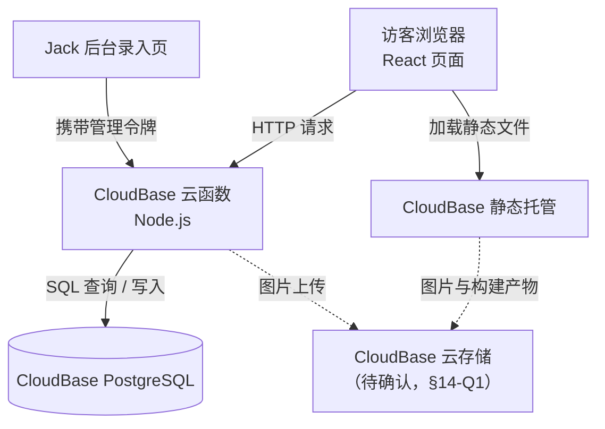
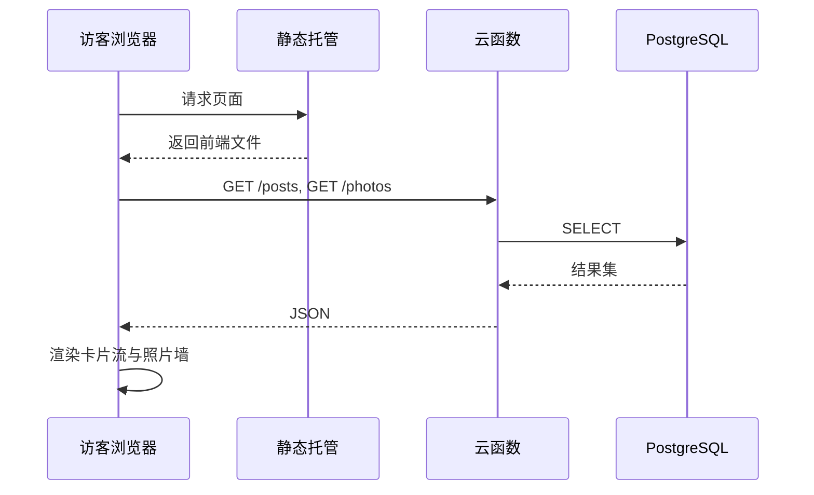

# TECH_DESIGN.md —— Ja的小屋 · 技术设计

> 上游依据：`PRD.md`（功能范围与验收标准，**需按 §13.1 同步变更**）· `research.md`（同类产品研究）· `things.md`（任务拆解）
> 版本：**v1.0** · 日期：2026-09-24 · 作者：Jack（仓库账号 JIMIHA-WU）
> **技术路线**：React + Vite（前端）／CloudBase 云函数 Node.js（后端）／CloudBase PostgreSQL（数据库）／CloudBase 静态托管（部署）
> v1.0 说明：本文按 **2026-09-24 决定采用的全栈方案** 重写，**以该方案为唯一口径**，不再保留"纯静态 / 全栈"双轨并行写法与调研过程记录，使执行者无需在两套设计之间切换。改换前的版本另存为 `TECH_DESIGN.v0.6.bak.md`。

---

## 0. 怎么读这份文件

- **§1** 是一句话路线；**§2–§3** 说明"为什么是这套"；**§4–§9** 说明"怎么实现"（结构 / 数据 / 接口 / 数据流 / 错误处理 / 密钥）；**§10–§12** 说明"怎么上线与推进"；**§13** 是与 PRD 的对接（含必须同步修改的清单）；**§14–§15** 是尚未确定的事与前提假设。
- 本文只写**这一版要做的**。实现时如与本文冲突，以本文为准；本文没写的，按 §14 处理，**不擅自决定**。

---

## 1. 一句话技术路线

**前端用 React + Vite 写成组件化页面，通过 REST 接口向 CloudBase 云函数取数据；内容存放在 CloudBase PostgreSQL；页面与静态资源由 CloudBase 静态托管发出。**

---

## 2. 系统架构

### 2.1 三层分工

| 层 | 技术 | 职责 | 明确不做 |
| --- | --- | --- | --- |
| **前端** | React + Vite | 渲染页面、处理交互、调用接口 | 不直连数据库、不持有密钥 |
| **后端** | CloudBase 云函数（Node.js） | 接收请求、校验权限、读写数据、加工返回格式 | 不渲染页面 |
| **数据** | CloudBase PostgreSQL | 存储内容、评论、照片记录 | 不承担业务规则 |

**边界原则**：**只有云函数能访问数据库；前端只认接口，不认表结构。** 这条原则的作用是——今后更换数据库或更换前端，另一侧不需要改动。

### 2.2 架构图



---

## 3. 技术选型与理由

### 3.1 选型清单

| 环节 | 选择 | 理由 | 备选与代价 |
| --- | --- | --- | --- |
| 前端框架 | **React 18 + Vite** | 组件化适配"卡片流"这类重复结构；Vite 构建快、开发时热更新 | 原生 JS：代码量随内容增长而失控；Vue：生态同样成熟，但与示范路线不一致 |
| 前端样式 | **原生 CSS + CSS 变量** | PRD 要求全站视觉统一，CSS 变量是最轻的统一手段 | Tailwind：写得快，但引入类名噪音与额外构建依赖 |
| 前端路由 | **React Router** | 详情页需要独立 URL（可分享、可收藏、可直达） | 单页锚点：详情页无法单独分享 |
| 请求方式 | **原生 fetch + 统一封装** | 无需额外依赖；封装一处便于集中处理错误 | axios：多一个依赖，收益有限 |
| 后端运行时 | **Node.js 云函数** | 与前端同语言；按调用计费，无请求时零成本 | 常驻服务器：需运维、需付费 |
| 数据库 | **PostgreSQL（CloudBase）** | 关系型，适配"内容 + 评论 + 照片"这类结构化数据，支持按时间与类型查询 | 文档型数据库：查询灵活但一致性弱；静态 JSON = 原方案做法，无法支持评论 |
| 图片来源 | **待确认（§14-Q1）** | 内容已入库，图片宜走云存储而非随仓库 | 随仓库：仓库体积迅速膨胀、加载变慢 |
| 部署 | **CloudBase 静态托管 + 云函数** | 前后端同一平台，配置与权限统一 | 分离部署：多平台、多套鉴权、多份配置 |

### 3.2 为什么采用这套路线（6 条理由）

1. **消除已记录的三处已知缺陷，而非缓解**：PRD §7.5（加内容需手工改 HTML）、§12.4（手工同步数字易漏）、§6.2（无评论与统计）——本方案对三者均为根治。
2. **维护成本的结构性改变**：加一篇内容由"改 5 处文件 + 提交 + 推送"变为"后台填表 + 保存"，这是能否长期更新的分水岭。
3. **引入正反馈机制**：阅读量与评论让"有没有人看"变得可见；PRD §7.3 记录的最大风险是"上线即荒废"，静态站没有任何机制对抗它。
4. **与同类产品的实际形态一致**：`research.md` 已核实的三个参照物（知遥、LX Blog、XingHuiSama）**均为后端驱动**——这类站点最终都会走到这一步。
5. **符合项目的双重目标**：既作为学习载体（接口设计、数据库建模、鉴权、部署运维），也满足"样式完全自主"的诉求。
6. **不推翻已确认的设计**：版式、区块顺序、内容类型、隐私边界、命名规范继续有效。**改变的只有"内容存哪、页面怎么取数"。**

### 3.3 已知代价（必须接受）

| # | 代价 | 说明 |
| --- | --- | --- |
| 1 | **交付形态改变** | 不再是"4 个 HTML 文件"，而是"前端 + 后端 + 数据库"三部分；一次性完成的时间显著长于纯静态 |
| 2 | **学习曲线** | 需掌握 React/Vite、云函数、SQL；零基础通常以周计 |
| 3 | **需云账号与环境** | 注册、实名、创建环境属本人操作，无法代办 |
| 4 | **新增运维面** | 密钥保管、数据库备份、垃圾评论治理、配额与费用监控 |
| 5 | **无视觉收益** | 第一诉求是"好看"，后端不提升观感；它的价值在"可维护"与"可互动"，不在"更好看" |

---

## 4. 项目结构

```
myself-block/
├─ client/                        前端（React + Vite）
│  ├─ index.html
│  ├─ package.json
│  ├─ vite.config.js
│  └─ src/
│     ├─ main.jsx                 入口
│     ├─ App.jsx                  路由与总体布局
│     ├─ api/index.js             接口封装（统一错误处理，全站唯一取数入口）
│     ├─ pages/
│     │  ├─ Home.jsx              首页：信息卡 / 照片墙 / 记录流 / 页脚
│     │  ├─ Post.jsx              笔记详情页
│     │  └─ Admin.jsx             后台录入页（仅本人使用）
│     ├─ components/
│     │  ├─ TopBar.jsx            顶栏（吸顶）
│     │  ├─ InfoCard.jsx          信息卡
│     │  ├─ PhotoWall.jsx         照片墙（错落两列）
│     │  ├─ Lightbox.jsx          图片灯箱（放大 / 切换 / 关闭）
│     │  ├─ NoteCard.jsx          笔记卡
│     │  └─ MomentCard.jsx        感悟卡
│     └─ styles/                  全局样式与 CSS 变量（视觉统一在此定义）
├─ server/                        后端（CloudBase 云函数）
│  ├─ functions/
│  │  ├─ posts/                   内容读写
│  │  ├─ photos/                  照片记录
│  │  └─ comments/                评论写入与读取
│  └─ shared/                     公共模块：数据库连接、鉴权、错误格式
├─ db/                            数据库脚本
│  ├─ schema.sql                  建表
│  └─ seed.sql                    初始内容（由现有素材导入）
└─ docs/                          文档归档（PRD / 本文件 / things 的副本或链接）
```

**两处"只写一次"的地方**：`client/src/api/`（取数）与 `server/shared/`（鉴权与错误格式）。集中在一处的作用是——改造或换平台时只动这两处，不必逐页逐个函数修改。

---

## 5. 数据模型

### 5.1 表设计

| 表 | 字段 | 说明 |
| --- | --- | --- |
| `posts` | id, type, title, body, published_at, cover_path, created_at | `type` 取 `note` / `moment`：笔记与感悟同表，用类型区分，对应 PRD"同一条卡片流" |
| `photos` | id, file_path, sort_order, created_at | `sort_order` 决定照片墙展示顺序 |
| `comments` | id, post_id, nickname, content, created_at, status | `status` 用于审核与隐藏（默认值见 §14-Q2） |
| `projects` | id, name, summary, tech_tags, link, created_at | 对应"做过的事"。当前无素材，**建表但不使用**（PRD §6.6 的触发条件未达成） |

### 5.2 字段约束

| 字段 | 约束 | 理由 |
| --- | --- | --- |
| `posts.type` | 枚举 `note` / `moment` | 防止出现第三种未定义类型 |
| `posts.title` | `note` 必填，`moment` 可空 | PRD：笔记必须有标题，感悟可无标题 |
| `posts.published_at` | 不得为空，默认当前时间 | PRD：日期一律采用发布时间 |
| `posts.body` | 不得为空 | 空内容对访客无意义 |
| `comments.status` | 枚举 `pending` / `visible` / `hidden` | 评论需要审核与隐藏能力 |
| `photos.sort_order` | 不可重复，可重排 | 照片墙顺序必须可控 |

### 5.3 索引建议

| 索引 | 用途 |
| --- | --- |
| `posts(published_at DESC)` | 首页卡片流按时间倒序 |
| `posts(type)` | 按类型筛选（后台使用，为将来分类预留） |
| `comments(post_id)` | 详情页读取某篇的评论 |

---

## 6. 接口（API）列表

### 6.1 接口清单

| 方法 | 路径 | 用途 | 鉴权 | 主要错误码 |
| --- | --- | --- | --- | --- |
| GET | `/posts?type=note&limit=20` | 内容列表（时间倒序） | 无 | 500 |
| GET | `/posts/:id` | 内容详情 | 无 | 404 / 500 |
| POST | `/posts` | 发布内容 | 管理令牌 | 401 / 413 / 500 |
| PATCH | `/posts/:id` | 修改内容 | 管理令牌 | 401 / 404 / 500 |
| DELETE | `/posts/:id` | 删除内容（软删除） | 管理令牌 | 401 / 404 / 500 |
| GET | `/photos` | 照片记录清单 | 无 | 500 |
| POST | `/photos` | 新增照片记录 | 管理令牌 | 401 / 500 |
| GET | `/comments?post=:id` | 读取某篇的可见评论 | 无 | 500 |
| POST | `/comments` | 提交评论 | 无（限流） | 429 / 413 / 500 |

**相对此前版本的补充**：增加了 `PATCH /posts/:id` 与 `POST /photos`。理由：内容入库后，"修改已有内容"与"新增照片"是高频动作；若只有 `POST`，改一个字也需要删除后重发，既麻烦又会产生无意义的历史记录。

### 6.2 鉴权与限流

| 项 | 方案 | 说明 |
| --- | --- | --- |
| 写入鉴权 | 请求头携带管理令牌，云函数与环境变量中的值比对 | 不建立账号体系（PRD §6.2 已排除登录注册），一期只有 Jack 一个写入者 |
| 评论提交 | 免登录 + 基础限流（同一 IP 在时间窗内的条数上限） | 访客无法登录，评论必须开放；用限流遏制刷屏 |
| 删除策略 | 允许软删除 | 避免误删后不可恢复 |
| 令牌传递 | 仅存于后端环境变量与本人的本地凭据中 | **不得出现在前端代码、仓库、截图中** |

### 6.3 返回格式约定

```
成功：{ "ok": true,  "data": ... }
失败：{ "ok": false, "error": { "code": "...", "message": "..." } }
```

**理由**：格式统一后，前端只需写一处错误处理；新增接口不必重新约定。

---

## 7. 前后端数据流

### 7.1 读路径（访客看内容）

1. 浏览器向静态托管请求并加载前端文件；
2. 页面挂载后调用 `GET /posts?limit=20` 与 `GET /photos`；
3. 云函数连接 PostgreSQL 执行查询；
4. 结果加工为约定格式后返回 JSON；
5. 前端渲染卡片流与照片墙。

**关键点**：**首屏骨架不依赖接口返回**——接口慢或失败时，页面结构仍在（见 §8）。

### 7.2 写路径（Jack 发布内容）

1. 打开后台录入页，填写标题与正文、选择类型（笔记 / 感悟）、选择图片；
2. 图片上传至云存储（位置见 §14-Q1），取得 `file_path`；
3. 携带管理令牌调用 `POST /posts`；
4. 云函数校验令牌 → 校验字段约束 → 写入数据库 → 返回新记录；
5. 前台刷新即可见；**数字（照片数 / 笔记数 / 最后更新时间）由接口实时计算，不再手工同步**。

### 7.3 评论路径

1. 访客在详情页填写昵称与内容；
2. 调用 `POST /comments`；云函数先做限流检查，再按 §14-Q2 确定的策略写入；
3. 详情页调用 `GET /comments?post=:id` 读取并按 `status` 渲染。

### 7.4 数据流图



---

## 8. 错误处理与降级

| 场景 | 现象 | 处理 |
| --- | --- | --- |
| 云函数超时 | 某区块迟迟不出 | 前端设超时（建议 8 秒），超时后该区块显示"加载失败，点此重试" |
| 接口返回 500 | 请求失败 | 显示统一错误提示；**不向前端暴露堆栈或内部信息** |
| 数据库连接失败 | 云函数报错 | 云函数捕获并记录日志，对外返回通用错误信息 |
| 令牌无效 401 | 后台提交失败 | 提示"令牌无效或已过期"，不透露校验细节 |
| 评论被限流 429 | 提交被拒 | 提示"提交过于频繁，请稍后再试" |
| 图片加载失败 | 出现破图 | 显示 `alt` 文字 + 占位底色 |
| 图片上传失败 | 表单中断 | 保留已填内容，允许单独重试上传 |
| 访问不存在的详情页 | 页面无内容 | 显示"内容不存在"并提供返回首页入口 |

**降级原则**：**任何后端故障都不得导致整页白屏**——静态骨架先显示，数据区块单独失败、单独重试。

---

## 9. 环境变量与密钥管理

| 变量 | 用途 | 存放位置 |
| --- | --- | --- |
| `DB_CONNECTION_STRING` | 连接 PostgreSQL | 云函数环境变量（**不进仓库**） |
| `ADMIN_TOKEN` | 校验本人写入权限 | 云函数环境变量（**不进仓库**） |
| `TZ` | 统一时区，保证发布日期正确 | 云函数环境变量 |
| （前端变量） | **前端不需要任何密钥** | 前端只调用接口，不持有密钥 |

**硬规则**：

1. 任何密钥不写进代码、不进仓库、不贴进截图；
2. **前端不得包含数据库连接串**——一旦包含即等于公开；
3. 本地开发使用 `.env`，已由 `.gitignore` 拦截（Day 2 已验证生效）；
4. 泄露后的处置顺序：**先在云平台轮换密钥**，再排查提交历史——内容一旦提交过，删除文件不等于消失。

---

## 10. 部署与上线

| 项 | 方案 |
| --- | --- |
| 前端 | CloudBase 静态托管 |
| 后端 | CloudBase 云函数（与前端同一环境） |
| 数据库 | CloudBase PostgreSQL（同一环境） |
| 图片 | 云存储（待确认，§14-Q1） |
| 访问地址 | **待环境创建后填写**（对应 PRD §4.8 的地址栏） |
| 发布流程 | 前端执行构建后上传产物；云函数独立部署；数据库变更一律走 `db/` 脚本 |
| 回滚 | 前端回滚上一版构建产物；云函数回滚上一版本；**数据库变更前先备份** |

**前置人工操作（Jack 本人执行，我只提供步骤与验收点）**：注册腾讯云 → 完成实名 → 开通 CloudBase → 创建环境 → 记录环境 ID。

---

## 11. 分阶段实施计划

不建议一次性做成全栈——那会出现"什么都还没做完、什么都看不到"。分三段推进：

| 阶段 | 内容 | 完成后可达到 | 依赖 |
| --- | --- | --- | --- |
| **一** | 前端视觉壳：首页 / 详情页 / 灯箱，数据先写死或读本地 JSON，部署到静态托管 | 视觉、兼容、"愿意发链接"可先验收，**有链接可发** | 无（可立即开始） |
| **二** | 建库 + 云函数 + 后台录入页；素材导入数据库；前端改为接口取数 | 可在网页后台录内容；数字自动准确 | 腾讯云环境（§10） |
| **三** | 评论 + 阅读量（含审核与限流） | 互动类验收通过 | 阶段二 |

**阶段一的额外价值**：它同时是"界面定稿"的过程。视觉在阶段一定下来之后，阶段二只替换数据来源，样式不必返工。

---

## 12. 迁移注意事项

| 变化 | 影响 | 应对 |
| --- | --- | --- |
| 前端取数方式改变（阶段一 → 二） | 各页面组件需从"读本地数据"改为"调接口" | 阶段一即把取数集中在 `api/` 一层，改造只动这一处 |
| 内容从文件迁入数据库 | 需一次性导入 | 编写导入脚本；导入后**逐条核对数量与日期**再删旧文件 |
| 图片改走云存储 | 路径规则变化 | 统一由 `file_path` 字段指向云存储地址；前端不写死本地路径 |
| 更换云平台 | 接口地址、鉴权方式变化 | 取数集中在 `api/` 一处，改动集中 |
| 数据库结构变更 | 已有数据受影响 | 每次变更写脚本并先在测试环境跑通；**变更前备份** |
| PRD 尚未同步（§13.1） | 两份文档口径不一致 | 尽快执行 PRD 变更，在此之前以本文为准 |

---

## 13. 与 PRD 的对接

### 13.1 PRD 待变更清单（**必须同步，否则两份文档互相矛盾**）

| PRD 位置 | 现在写的 | 需要改成 |
| --- | --- | --- |
| §4.1 / §4.2–4.7 功能范围 | 纯静态、4 个 HTML 页面、手工改文件 | 增加：**后台录入页 / 接口取数 / 评论与阅读量** |
| §4.8 交付与上线 | 静态托管 + 地址待定 | CloudBase 静态托管 + 云函数 + 数据库 |
| §5 验收标准 | 六组验收（均不依赖后端） | 新增四类：**录入即生效 / 评论提交成功 / 统计可见 / 接口异常有降级** |
| §6.2 本期不做 | 评论、热度、统计一律不做 | 评论与统计**移出"不做"**；用户登录仍不做 |
| §6.7 | 四步变更流程 | **本次变更按该流程执行并留痕** |
| §10 / §12.6 | 评论需"≥3 位访客提出"；托管 Day 5 定 | 触发条件已达成，移入范围；托管改为 CloudBase |

### 13.2 验收项与技术保证的对应

| 验收类别 | 由什么保证 |
| --- | --- |
| 内容可读、可进详情页 | React Router 路由 + `GET /posts/:id` |
| 照片可点开放大、可左右切换 | `Lightbox.jsx` + `GET /photos` |
| 数字与实际一致 | 由接口实时计算，不再依赖人工同步 |
| 录入即生效 | 后台录入页 + `POST /posts` |
| 评论提交成功并显示 | `POST /comments` + `GET /comments` |
| 接口异常不白屏 | §8 的分区块降级 |
| 全站视觉统一 | CSS 变量集中于 `styles/`，组件只引用变量、不写死色值 |
| 手机不横向滚动 | 响应式布局 + 最小宽度约束 |

---

## 14. 待确认问题（不猜）

| # | 问题 | 影响 | 建议 |
| --- | --- | --- | --- |
| Q1 | **图片存放位置**：云存储 / 仍随仓库 | 决定 `photos.file_path` 的含义与上传流程 | 用云存储——内容已入库，图片继续随仓库会让仓库迅速膨胀 |
| Q2 | **评论是否需要先审核**：先审后显 / 直接显示 + 事后隐藏 | 决定 `comments.status` 的默认值 | 先审后显（默认 `pending`），以治理垃圾评论 |
| Q3 | **腾讯云账号与环境是否已创建** | 决定阶段二能否开始 | 需先注册（本人操作） |
| Q4 | **是否使用自定义域名** | 影响 PRD §4.8 的地址与备案 | 第一版不使用 |
| Q5 | **后台录入页的访问方式**：独立路径 + 令牌 | 影响安全性与实现量 | 独立路径 + 令牌，不建立账号体系 |
| Q6 | **首版内容是否全部迁移**：6 图 + 3 笔记 + ≥1 感悟 | 决定导入脚本范围 | 全部迁移 |

---

## 15. 临时假设（本文结论的生效前提）

| # | 假设 | 不成立时需要改 |
| --- | --- | --- |
| H1 | 采用 CloudBase 三件套，不更换云平台 | §3.1、§6、§9、§10 需重写 |
| H2 | 一期只有 Jack 一个写入者，用管理令牌而非账号体系 | §6.2 需引入登录与用户表 |
| H3 | 评论不做多级回复 | `comments` 需增加 `parent_id`，接口需改为树形返回 |
| H4 | 图片走云存储（待 Q1 确认） | 若改为随仓库，§4、§7.2、§10 与 PRD §8 的命名规范需调整 |
| H5 | 首版内容量小（6 图 + 3 笔记 + 1 感悟） | 列表分页与加载策略需调整 |
| H6 | 按 §11 分阶段推进 | 若要求一次做成全栈，§11 需重排，且过程中无可展示成果 |

---

## 16. 变更记录

| 日期 | 变更 |
| --- | --- |
| 2026-09-24 | **v1.0 重写**：按当日决定采用的全栈方案，以该方案为**唯一口径**重写全篇；删去此前的双轨并行写法与调研过程记录，使执行者无需在两套设计之间切换。补齐接口（`PATCH /posts`、`POST /photos`）、字段约束与索引、鉴权与限流、分区块降级原则、密钥硬规则、部署与回滚；新增 §11 分阶段实施、§13 PRD 对接与待变更清单、§14 待确认 6 项、§15 假设 6 条。改换前的版本另存为 `TECH_DESIGN.v0.6.bak.md`。 |
